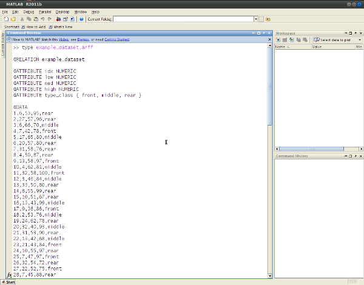

ARFF reader/writer for MATLAB
=============================

__ARFF reader/writer for MATLAB__ is a small library that support 
Weka's ARFF files without using any native Java binding.

I needed to exchange MATLAB’s simulation data to and from Weka, 
the well-known data mining and machine learning software. 
I was looking for a lightweight solution that could avoid 
the use of plain formats (like TSV or CSV). This small library 
does the hard work of parsing the ARFF file format without using 
any external binding.

For more info, look [here](http://decabyte.it/projects/arff-reader-writer-for-matlab/).

Keep in mind that some features are missing but feel free to add them
or suggest some changes by cloning the git repository and sending a pull request.

## Usage

Look inside `examples` dir for a typical usage scenario or read
the documentation of the reader function `help arff_read` and 
the writer function `help arff_write`.

## References

* [ARFF format specification](http://weka.wikispaces.com/ARFF)
* [XRFF format specification](http://weka.wikispaces.com/XRFF)

## LICENSE - "MIT License"

Copyright (c) 2012-2013 Valerio De Carolis, http://decabyte.it

Permission is hereby granted, free of charge, to any person
obtaining a copy of this software and associated documentation
files (the "Software"), to deal in the Software without
restriction, including without limitation the rights to use,
copy, modify, merge, publish, distribute, sublicense, and/or sell
copies of the Software, and to permit persons to whom the
Software is furnished to do so, subject to the following
conditions:

The above copyright notice and this permission notice shall be
included in all copies or substantial portions of the Software.

THE SOFTWARE IS PROVIDED "AS IS", WITHOUT WARRANTY OF ANY KIND,
EXPRESS OR IMPLIED, INCLUDING BUT NOT LIMITED TO THE WARRANTIES
OF MERCHANTABILITY, FITNESS FOR A PARTICULAR PURPOSE AND
NONINFRINGEMENT. IN NO EVENT SHALL THE AUTHORS OR COPYRIGHT
HOLDERS BE LIABLE FOR ANY CLAIM, DAMAGES OR OTHER LIABILITY,
WHETHER IN AN ACTION OF CONTRACT, TORT OR OTHERWISE, ARISING
FROM, OUT OF OR IN CONNECTION WITH THE SOFTWARE OR THE USE OR
OTHER DEALINGS IN THE SOFTWARE.
