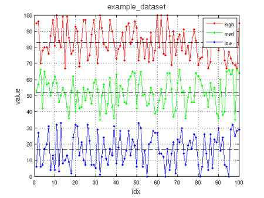
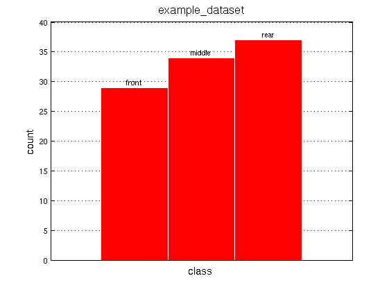

Examples
=============================

__ARFF reader/writer for MATLAB__ is a small library that support 
Weka's ARFF files without using any native Java binding.

It comes with a couple of usage examples:
* ARFF file writing
* ARFF file reading

Keep in mind that some features are missing and the ARFF spec isn't completely 
covered at this time. However for common operations (like parsing _numeric_, 
_real_, _integer_, _string_, _date_ and last but not least 
_nominal specification_ datatypes) and not-mission-critical use the whole lib is fine.

Feel free to extend the support or add the missing features by cloning
the git repository and sending a _pull request_.

## Writing

```matlab
% arff_file => output file name (.arff or .arff.gz for compressed format)
% data      => struct array (size x attributes) of dataset data
% relname   => dataset relation name
%
% nomspec   => struct of nominal specification mappings (optional)
%                  nomspec.field_class = { 'one', 'two', 'three' };

arff_write(arff_file, data, relname, nomspec);
```

If using the `.arff.gz` extension keep in mind that the compression is done by
saving a .arff file to a temp dir (using OS default preferences), outputing its
compressed version using the `arff_file` path and finally removing the temp file.

## Reading

```matlab
% arff_file => output file name (.arff or .arff.gz for compressed format)
%
% data      => struct array (size x attributes) of dataset data
% relname   => dataset relation name
% nomspec   => struct of nominal specification mappings (optional)
%                  nomspec.field_class = { 'one', 'two', 'three' };

[data, relname, nomspec] = arff_read(arff_file);
```

If using the `.arff.gz` extension keep in mind that the decompression is done by
saving a .arff file to a temp dir (using OS default preferences), parsing its
content and finally removing the temp file.

## Dataset

For convenience is included a dummy dataset `example_dataset.arff` which
is used by the example scripts to create a couple of visualizations (reading the
data series and the nominal specification attribute):

### Series Example


### Histogram Example

